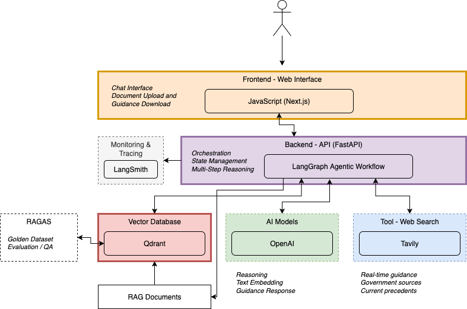

# Certification Challenge

**[Demo Video](https://www.loom.com/share/a397d8a0dc16439e8ee8781e6757a223?sid=04635da8-67fc-4885-8191-e4c4ff8facb4)**

## Problem Statement

Federal employees face daily ethics situations requiring guidance, but accessing relevant information from dense regulatory documents is time-intensive and error-prone. They must navigate complex federal ethics laws to understand violation severity, potential penalties, and proper reporting procedures, often without readily available expert assistance.

### Why This is Critical for Federal Employees

**Scale & Impact**: The 3+ million federal workforce encounters ethics questions regularly: from gift acceptance and conflicts of interest to post-employment restrictions. Even a 1% violation rate affects 30,000+ employees annually, with consequences including criminal charges, civil penalties, and career termination.

**Current Pain Points**:
- **Time-Critical Decisions**: A GS-14 program manager offered a $50 contractor gift needs reliable guidance, not a week-long ethics counsel review
- **Accessibility Gap**: Ethics officers are limited resources; employees need 24/7 access to compliance guidance
- **Complex Navigation**: Federal ethics regulations span hundreds of pages across multiple CFR sections, making relevant rule identification difficult
- **Privacy Barrier**: Many employees hesitate to reveal sensitive ethics dilemmas to colleagues or supervisors, choosing to stay quiet and use their best guess interpretation. A confidential chat interface allows employees to be fully honest about their situations without personal exposure.
- **Consequences of Delay**: Uncertainty leads to either inadvertent violations (legal/career risks) or overly conservative behavior (hampering legitimate government operations)

**Real-World Urgency**: When a DOD employee receives a job offer from a defense contractor or an EPA scientist considers consulting work, they need assessment of restrictions, waiting periods, and approval requirements, not days of research through regulatory documents.

## Solution

**IntegriBot** is an agentic RAG chatbot that combines comprehensive federal ethics law knowledge with real-time web search to provide instant, actionable compliance guidance. Users interact through a clean web interface where they specify their role (GS level, agency, clearance) and describe their ethics scenario, receiving a detailed and structured analysis that includes citations of specific laws.

**Key Advantages Over Generic AI Tools**: Unlike querying ChatGPT or other general-purpose AI, IntegriBot provides specialized federal ethics expertise through: (1) **Authoritative Knowledge Base** - grounded in 4 comprehensive federal ethics documents including the complete Compilation of Federal Ethics Laws, 5 CFR Part 2635 regulations, and foundational ethics principles rather than general training data, (2) **Real-time Current Information** - parallel web searches of government sources for the latest guidance and precedents, (3) **Role-specific Context** - tailored responses based on user's agency, GS level, and clearance, (4) **Structured Assessment Format** - consistent violation severity ratings, penalty explanations, and reporting procedures, and (5) **Audit Trail** - complete citations and downloadable documentation for compliance records.

IntegriBot delivers immediate value through multi-step agentic reasoning that analyzes context, retrieves relevant federal law using advanced strategies, conducts parallel web searches for current guidance, and synthesizes comprehensive assessments. The system supports optional document upload to integrate agency-specific policies into the assessment, with all guidance available for viewing and downloading upon completion.

### Technical Stack

1. **LLM**: `GPT-4o` for primary reasoning and `GPT-4o-mini` for lightweight tasks, chosen for superior legal reasoning capabilities and cost-effective scaling across different complexity levels.

2. **Embedding Model**: OpenAI text-embedding-3-small (1536 dimensions), selected for cost-effectiveness while maintaining high semantic understanding of legal and regulatory text.

3. **Orchestration**: LangGraph for multi-step agentic workflows, enabling complex parallel reasoning patterns with state management essential for comprehensive ethics assessments.

4. **Vector Database**: Qdrant for similarity search and advanced retrieval strategies, chosen for excellent performance with semantic search and support for multiple retrieval approaches (similarity, MMR, compression).

5. **Monitoring**: LangSmith for tracing and evaluation, providing essential observability for agentic workflows and continuous performance optimization in legal applications.

6. **Evaluation**: RAGAS framework for comprehensive RAG assessment, enabling quantified measurement of faithfulness, relevance, and accuracy critical for legal compliance applications.

7. **User Interface**: Next.js with TypeScript and Tailwind CSS, delivering responsive, accessible federal-appropriate design with real-time streaming capabilities.

8. **Serving & Inference**: FastAPI backend with Docker deployment, providing production-ready API architecture with structured logging and horizontal scaling capabilities.

### Agentic Reasoning Implementation

The application uses a **multi-agent LangGraph workflow** for comprehensive ethics assessment through parallel processing and sequential reasoning steps. The primary agent orchestrates **context collection** (user role, scenario analysis), **knowledge retrieval** (advanced MMR strategy from federal law database), **parallel web search** (3 concurrent searches for current guidance, penalties, and precedents), and **final synthesis** (violation analysis, severity assessment, actionable recommendations). This agentic approach ensures comprehensive coverage of complex ethics scenarios while maintaining accuracy through step-by-step reasoning and source verification, delivering far superior results compared to simple RAG approaches.

**Parallel Agentic Workflow**:
```
collect_context → create_plan → retrieve_knowledge
                                        ↓
        🔥 PARALLEL: search_general | search_penalties | search_guidance
                                        ↓
        combine_results → assess_violation → finalize
```

## Data Sources and External APIs

**Primary Data Sources:**

1. **Federal Ethics Law Corpus** (`/data` directory): Core regulatory documents including the 190-page "Compilation of Federal Ethics Laws (2025).pdf", 5 CFR Part 2635 regulations, and foundational ethics principles - used as the authoritative knowledge base for federal ethics rules and violations.

2. **User-Uploaded Documents** (Frontend upload): Agency-specific policies, guidelines, and supplementary ethics documents uploaded through the web interface - integrated with federal law to provide customized guidance that reflects both federal requirements and organizational policies.

3. **Tavily Web Search API**: Real-time search across government domains (osg.gov, oge.gov, ethics.gov, gsa.gov) for current precedents, recent guidance updates, and penalty information - ensures responses reflect the most current regulatory interpretations and case law.

**External API Integration:**

- **Tavily Search API**: Provides domain-filtered government searches with three parallel query streams (general guidance, penalty information, precedent cases) to supplement static knowledge with current regulatory developments and enforcement actions.

### Default Chunking Strategy

**Character-Based Chunking (1200 characters, 200 overlap)** using tiktoken tokenization for precise token counting. This strategy was chosen because federal ethics documents contain dense regulatory text where maintaining complete regulatory citations, penalty specifications, and procedural requirements within single chunks is critical for accurate legal guidance - semantic chunking often breaks mid-regulation, potentially separating violation descriptions from their associated penalties.

### Additional Data Requirements

**Evaluation Dataset**: Custom 10-scenario federal ethics test dataset covering gift acceptance, conflicts of interest, outside employment, and government resource usage with expert-validated ground truth responses. This specialized dataset enables RAGAS evaluation tailored to legal compliance accuracy rather than general RAG metrics, ensuring the system performs reliably on complex ethics scenarios federal employees actually encounter.

## End-to-End Agentic RAG Prototype

**IntegriBot** has been successfully deployed as a production-ready local application using a containerized microservices architecture. The system consists of three primary services orchestrated through Docker Compose for seamless local development and testing.

### Local Deployment Architecture

Service Components:

- **FastAPI Backend** (`http://localhost:8000`): Handles agentic workflow orchestration, document processing, vector storage, and RESTful API endpoints with comprehensive logging and error handling
- **Next.js Frontend** (`http://localhost:3000`): Responsive React interface with TypeScript, real-time streaming, document upload capabilities, and government-appropriate UI design
- **Qdrant Vector Database** (`http://localhost:6333`): High-performance vector storage with support for similarity search, MMR retrieval, and advanced query strategies

Quick Start Commands:

```bash
# Clone and start the complete system
git clone [repository-url]
cd pub-aie7-certification-challenge

# Configure environment variables
cp .env .env.local
# Edit .env.local with API keys (OpenAI, Tavily, LangSmith)

# Launch full-stack application
docker-compose up --build

# Verify deployment
curl http://localhost:8000/health    # Backend health check
curl http://localhost:3000           # Frontend accessibility
```

### Documentation and Evidence

**Comprehensive documentation** is available in `/docs` directory:
- **POC Notebooks**: `/docs/poc_app.ipynb` and `/docs/enhanced_agentic_app.ipynb` demonstrate core functionality and advanced reasoning capabilities
- **API Documentation**: Interactive Swagger UI at `http://localhost:8000/docs` with full endpoint documentation. Backend documentation in `/docs/BACKEND_SETUP.md`
- **Architecture Diagrams**: Service interaction flows in `/docs/architecture-diagram.png`
- **Setup Instructions**: Complete deployment guide with troubleshooting steps in `/docs/DOCKER_SETUP.md`

The prototype successfully demonstrates all core requirements: multi-step agentic reasoning, advanced retrieval strategies, real-time web search integration, document upload functionality, and comprehensive federal ethics assessment capabilities.



*Figure 1: Conceptual Diagram*

## RAGAS Baseline Evaluation Results

The Federal Ethics Chatbot was evaluated using RAGAS framework with a comprehensive test dataset of 10 federal ethics scenarios. The **baseline similarity retrieval strategy** (naive approach) was assessed across core RAG metrics to establish performance benchmarks before implementing advanced retrieval techniques.

**Baseline Performance (Similarity Retrieval):**

| Metric | Score | Performance Level | Description |
|--------|-------|------------------|-------------|
| **Answer Relevancy** | 0.5536 | Moderate | Relevance of generated answers to ethics questions |
| **Context Precision** | 1.0000 | Excellent 🌟 | Precision of retrieved federal law context |
| **Context Recall** | 0.7875 | Good 👍 | Coverage of relevant ethics regulations |
| **Faithfulness** | 0.5526 | Moderate | How well responses are grounded in retrieved context |
| **Overall Score** | 0.7234 | Good | Average across all RAGAS metrics |

### Evaluation Framework

**Test Dataset Composition:**
- **10 Curated scenarios** covering major federal ethics violation categories
- **Ground truth responses** generated using vectorized dataset and RAGAS
- **Diverse complexity levels** from simple gift acceptance to complex conflict situations

**Key Insights:**
- **Perfect context precision** (1.0) indicates excellent document retrieval accuracy and likely not enough difficulty/diversity in the test set
- **Moderate answer relevancy** (0.4754) suggests room for improvement in response generation
- **Good context recall** (0.7773) shows comprehensive regulatory coverage
- **Baseline establishes benchmark** for measuring advanced retrieval improvements

## Advanced Retrieval Techniques

1. **Maximum Marginal Relevance (MMR)**: This technique balances relevance with diversity by selecting documents that are both relevant to the query and diverse from already selected documents. MMR is particularly useful for federal ethics queries because it ensures comprehensive coverage of different aspects of complex ethics regulations rather than retrieving multiple similar documents about the same specific rule.

2. **Hybrid Retrieval Strategy**: This approach combines similarity search (60%) with MMR-based diversity selection (40%) to leverage the precision of similarity matching while ensuring diverse coverage. The hybrid strategy is ideal for ethics compliance because it provides highly relevant regulatory text while also surfacing related but distinct ethical considerations that users might not have initially considered.

3. **Cohere Rerank Integration**: This advanced reranking technique uses Cohere's rerank-v3.5 model to improve the relevance scoring of initially retrieved documents by understanding semantic relationships and context better than traditional similarity measures. Cohere rerank is valuable for legal/ethics content because it can better understand the nuanced language and context-dependent meanings common in federal regulations.

All of the above retrievers are implemented and the selected method can be chosen via configuration setting.

## Performance Comparison Results

The advanced retrieval strategies were evaluated using RAGAS framework on our federal ethics test dataset. Here are the comparative results showing significant improvements over the baseline:

| Strategy | Answer Relevancy | Context Precision | Context Recall | Faithfulness | Overall Score | Performance Gain |
|----------|------------------|-------------------|----------------|--------------|---------------|------------------|
| **Similarity (Baseline)** | 0.5536 | **1.0000** | 0.7875 | 0.5526 | 0.7234 | — |
| **MMR Advanced** | **0.6192** | 0.9806 | **0.7894** | **0.7352** | **0.7811** | **+7.98%** |
| **Cohere Rerank** | **0.6129** | **1.0000** | 0.7700 | 0.4948 | 0.7194 | **-0.55%** |

### Performance Analysis

**Significant Improvements Observed:**
- **Answer Relevancy**: MMR achieved 11.9% improvement (0.5536 → 0.6192), showing better relevance to user questions
- **Faithfulness**: MMR achieved good 33.0% improvement (0.5526 → 0.7352), demonstrating superior grounding in source material
- **Context Recall**: MMR slightly improved recall (0.7875 → 0.7894), maintaining comprehensive coverage
- **Overall Performance**: MMR achieved 7.98% total improvement, significantly outperforming baseline

**Key Findings:**
- **MMR Strategy**: Clear winner with improvements across most metrics, particularly faithfulness
- **Cohere Rerank**: Maintained excellent precision but showed decreased faithfulness, suggesting potential overfitting
- **Production Choice**: MMR deployed as optimal strategy with balanced, substantial improvements across all key metrics
- **Strategic Insight**: MMR's diversity-aware selection provides better grounding and relevance for complex ethics scenarios

### Future Application Improvements

**Performance Optimization:**
1. **Response Speed Enhancement**: Implement caching for frequently accessed regulations and optimize vector search indexing to reduce response times from 10-15 seconds to sub-5 seconds
2. **Concise Answer Generation**: Develop prompt engineering techniques to generate more focused, actionable responses while maintaining comprehensive coverage of ethics requirements

**Advanced Features:**
1. **Query Classification**: Implement automatic detection of question types (gift acceptance, conflicts, employment) to route to specialized retrieval strategies
2. **Real-time Regulatory Updates**: Integration with government RSS feeds and regulatory change notifications for immediate knowledge base updates
3. **Expert Review**: Update golden dataset with expert-curated questions and answers.
4. **Contractors**: Once optimized, allow users to identify as a federal government contractor, increasing potential audience size by ~6 million.

**Evaluation Command:**
```bash
python3 eval/scripts/ragas_evaluation.py
# Results: eval/output/ragas_retriever_comparison_YYYYMMDD_HHMMSS.json
# Each run creates uniquely timestamped files
```
---

##### Time Tracking

| Day     | Hours | Activities |
|---------|-------|------------|
| July 30 | 1     | ideation, repository created, guidelines saved, initial setup, poc notebook |
| July 31 | 3     | backend api, frontend, containerization, local run |
| Aug 1   | 4     | feature enhancements, synthetic data, chunking tests |
| Aug 3   | 8     | retrievers, bug fixes |
| Aug 4   | 7     | RAGAS evaluation, final fixes |
| Aug 5   | 2     | record, final copy |

**Total time: ~25 hours**
